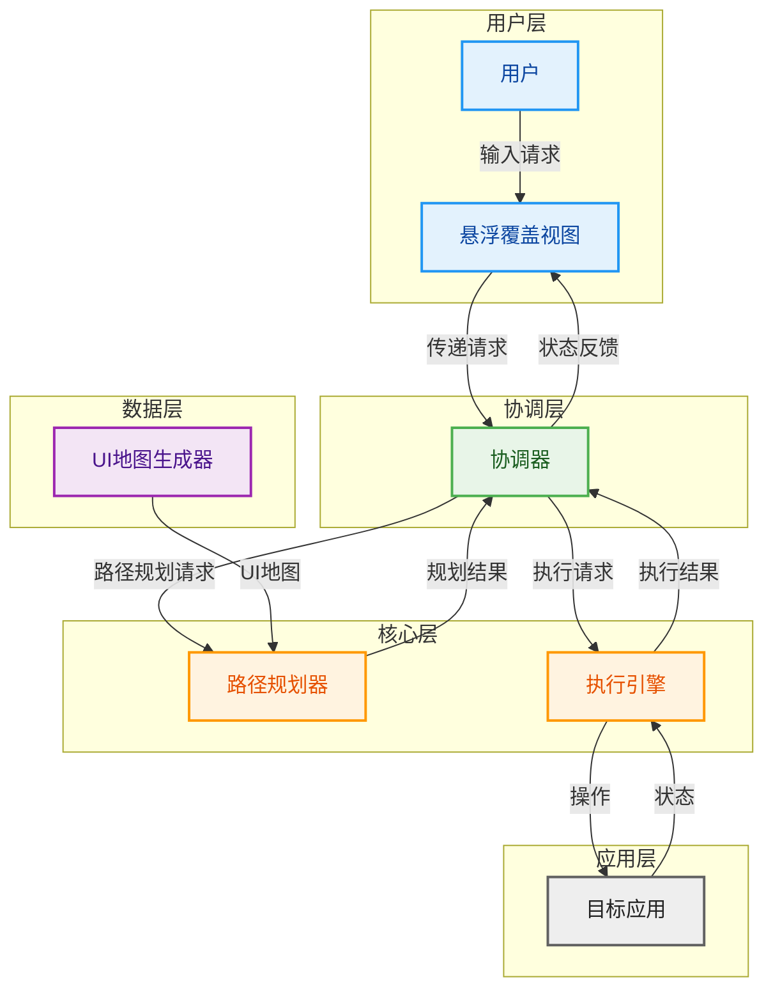
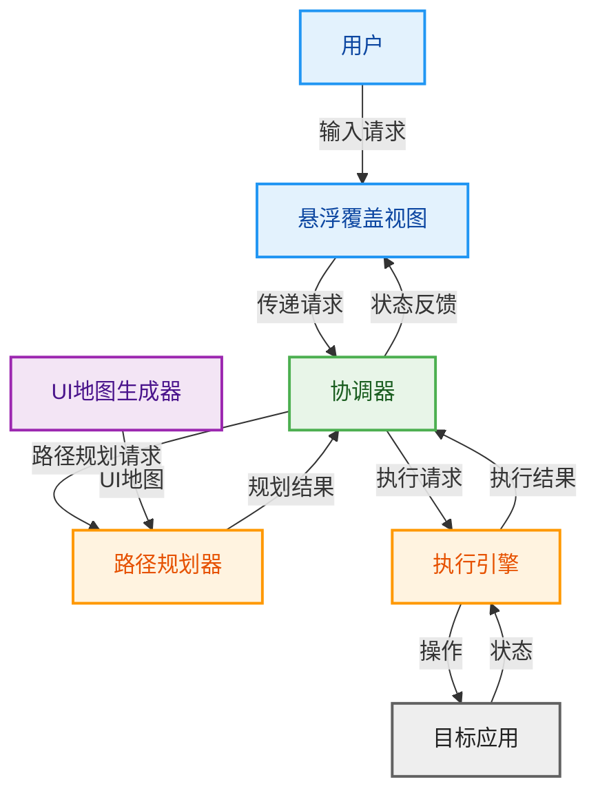
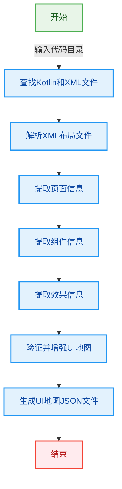
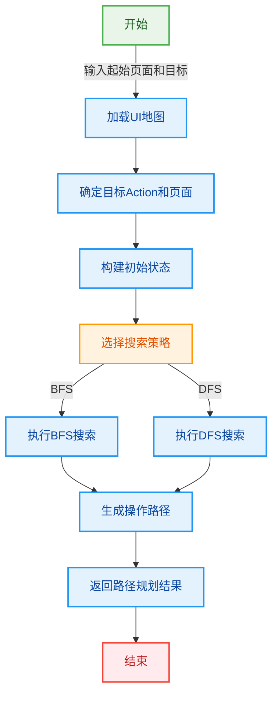
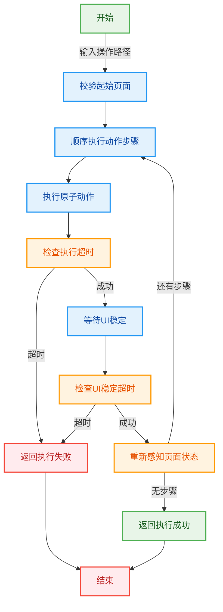
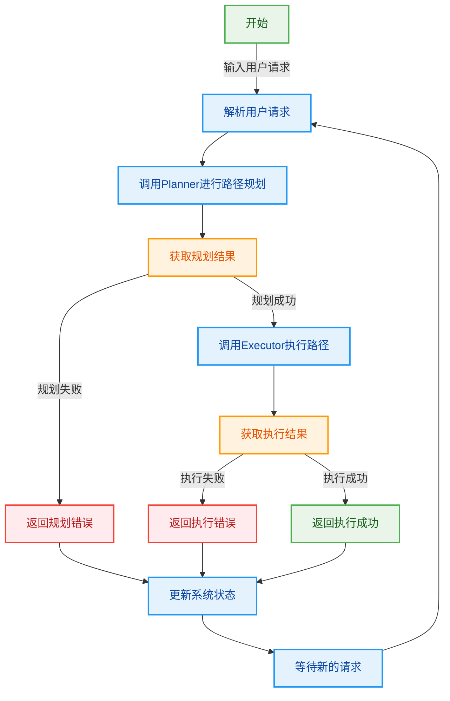

# 可复用自动操控助手项目指南

## 1. 项目概述

本项目是一个可复用的自动操控助手工具，可附加在正常的Android应用上，将其转化为具有自动操控能力的应用。系统采用模块化设计，包含四个核心模块：`map`、`planner`、`executor`和`orchestrator`，各模块职责明确，通过标准化接口进行交互。

## 2. 系统架构与交互关系

### 2.1 模块之间和用户、App配合关系

### 2.1.1 简洁版模块连接图

### 2.2 各模块运作流程

#### 2.2.1 Map模块运作流程

#### 2.2.2 Planner模块运作流程

#### 2.2.3 Executor模块运作流程

#### 2.2.4 Orchestrator模块运作流程

## 3. 核心模块功能与职责

### 3.1 Map模块

**功能**：从Android Kotlin代码中静态生成UI地图JSON文件，为路径规划提供基础数据。

**核心职责**：
- 查找和解析Kotlin代码和XML布局文件
- 提取页面、组件和效果信息
- 验证并增强UI地图
- 生成标准化的UI地图JSON文件

### 3.2 Planner模块

**功能**：基于UI地图执行路径规划，生成从起始页面到目标页面的最优操作路径。

**核心职责**：
- 加载和解析UI地图数据
- 确定目标Action和页面
- 构建初始状态
- 执行图搜索（BFS或DFS）
- 生成最优操作路径

### 3.3 Executor模块

**功能**：执行由planner生成的操作路径，实现自动化操作。

**核心职责**：
- 校验起始页面
- 顺序执行每个动作步骤
- 执行原子动作（带超时检测）
- 等待UI稳定（带超时检测）
- 重新感知页面状态
- 返回执行结果

### 3.4 Orchestrator模块

**功能**：协调其他模块的工作，接收用户请求，调用planner进行路径规划，然后调用executor执行规划的路径。

**核心职责**：
- 接收和解析用户请求
- 调用planner进行路径规划
- 调用executor执行规划的路径
- 监控执行状态
- 反馈执行结果
- 管理系统状态

## 4. 技术特点与优势

### 4.1 可复用性
- 模块化设计，可作为独立库集成到任何Android应用
- 标准化接口，便于与不同应用集成
- 无需修改原有应用代码，只需附加本工具

### 4.2 智能路径规划
- 支持BFS和DFS两种搜索策略
- 基于UI地图的静态分析，提高路径规划准确性
- 考虑页面跳转和组件交互，生成最优操作路径

### 4.3 实时执行控制
- 带超时检测的执行机制，提高系统稳定性
- 实时UI稳定检测，确保操作执行成功
- 实时页面状态感知，适应动态UI变化

### 4.4 用户友好的交互
- 悬浮覆盖视图，方便用户随时输入请求
- 实时执行状态反馈，让用户了解操作进展
- 简洁的错误提示，帮助用户理解失败原因

## 5. 应用场景

- **自动化测试**：自动执行应用中的操作流程，提高测试效率
- **用户辅助**：为用户提供自动化操作助手，简化复杂操作
- **无障碍功能**：为有障碍用户提供操作辅助，提高应用可访问性
- **演示和教程**：自动执行应用操作，用于产品演示和教程制作

## 6. 总结

本项目实现了一个可复用的自动操控助手工具，通过模块化设计和标准化接口，可轻松集成到任何Android应用中，为应用添加自动化操作能力。系统采用静态分析生成UI地图，结合智能路径规划和实时执行控制，实现了高效、准确的自动化操作。该工具具有广泛的应用场景，可提高应用的易用性、可测试性和可访问性。

---

**版本**: 1.0.0
**更新日期**: 2026-01-30