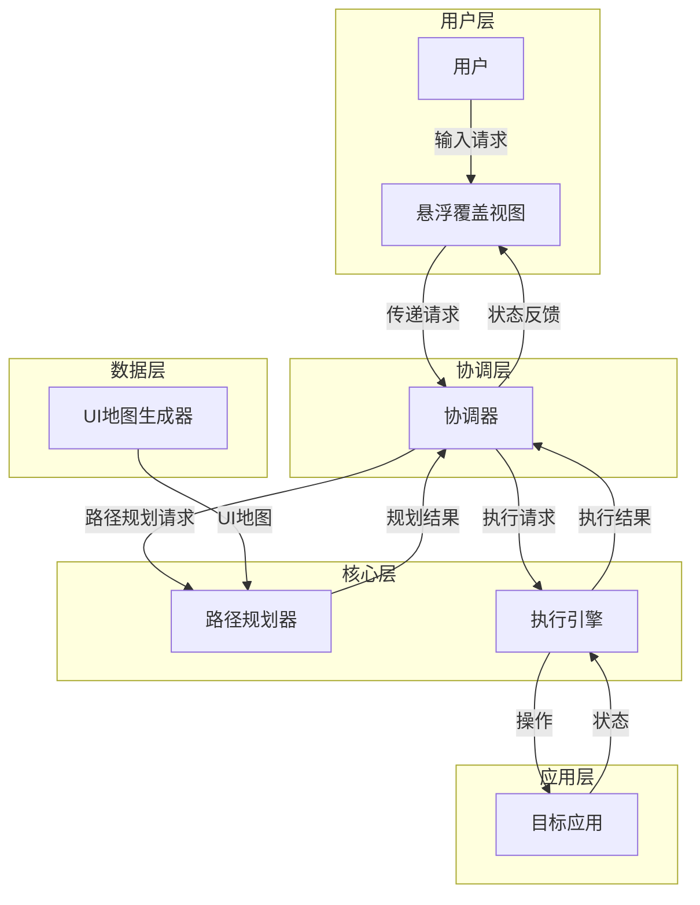

# 自动化操纵APP项目答辩准备文档

## 1. 项目概述

本项目是一个可复用的自动化操纵助手工具，可附加在正常的Android应用上，将其转化为具有自动操控能力的应用。系统采用模块化设计，包含四个核心模块：`map`、`planner`、`executor`和`orchestrator`，各模块职责明确，通过标准化接口进行交互。

## 2. 设计逻辑思想

### 2.1 模块化设计（重要，要知道有什么模块）

- **核心思想**：将系统分解为独立的、职责明确的模块，通过标准化接口进行交互
- **实现方式**：
  - `map`模块：负责从代码中静态生成UI地图
  - `planner`模块：基于UI地图执行路径规划
  - `executor`模块：执行规划好的操作路径
  - `orchestrator`模块：协调其他模块工作

### 2.2 静态分析与张量图转换

- **核心思想**：通过静态分析生成UI地图，并将其转换为张量图结构，为路径规划提供高效的数据基础
- **实现方式**：
  - `map`模块静态分析Kotlin代码和XML布局文件
  - 生成结构化的UI地图JSON文件，包含页面、组件、操作和转换关系
  - 将普通信息地图转换为张量图结构，优化路径规划算法性能
  - `planner`和`executor`基于动态状态执行操作
- **优势**：
  - 减少运行时开销，提高系统稳定性
  - 优化路径规划算法性能，支持复杂导航场景
  - 为系统提供统一、结构化的UI表示

### 2.3 图搜索算法应用

- **核心思想**：将UI导航抽象为图结构，使用图搜索算法寻找最优路径，结合自然语言处理和用户交互，处理复杂决策场景
- **实现方式**：
  - 主要使用BFS搜索策略（广度优先搜索）
  - 集成自然语言分析，理解用户意图
  - 实现智能决策点检测和交互式路径规划（如路径中出现需要进行对后续有影响的选择时提前交互锚定最终路径）
- **优势**：
  - 提高路径规划的准确性和效率
  - 处理需要用户参与的复杂决策场景
  - 减少因信息不足导致的执行失败

### 2.4 状态机思想

- **核心思想**：将复杂操作分解为原子动作，确保执行的稳定性和可靠性
- **实现方式**：
  - `executor`模块将操作分解为原子动作
  - 实现UI稳定检测，确保每个操作步骤的成功执行
  - 处理超时等异常情况
- **优势**：提高系统的可靠性和容错能力

### 2.5 协调器模式

- **核心思想**：通过orchestrator统一管理系统状态和流程，实现松耦合的系统架构
- **实现方式**：
  - 统一接收和解析用户请求
  - 协调planner和executor的工作
  - 管理系统状态和执行流程
- **优势**：提高系统的可维护性和可扩展性

## 3. 哲学理念

### 3.1 可复用性

- **理念**：设计为独立库，可集成到任何Android应用
- **实现**：模块化设计，标准化接口，无需修改原有应用代码
- **价值**：降低开发成本，提高开发效率

### 3.2 智能化

- **理念**：通过算法和策略提高系统的智能性
- **实现**：路径规划、模糊匹配、返回按钮策略等
- **价值**：提高系统的适应性和用户体验

### 3.3 可靠性

- **理念**：确保系统在各种情况下的稳定运行
- **实现**：超时检测、错误处理、多级后备方案等
- **价值**：提高用户信任度，减少系统故障

### 3.4 用户友好

- **理念**：提供简洁、直观的用户交互方式
- **实现**：悬浮覆盖视图、实时状态反馈、简洁的错误提示等
- **价值**：提高用户接受度，降低使用门槛

### 3.5 灵活性

- **理念**：适应不同应用和场景的需求
- **实现**：支持多种搜索策略、可自定义页面状态提供者等
- **价值**：提高系统的适用范围，满足不同用户需求

## 4. 技术特点与优势（略读，理解标题即可）

### 4.1 智能路径规划

- **特点**：支持BFS和DFS两种搜索策略，实现增强的搜索算法，集成自然语言分析和交互式规划
- **优势**：能处理复杂的页面导航场景，包括多级返回，同时能处理需要用户二次选择的复杂决策场景

### 4.2 模糊匹配功能

- **特点**：实现了基于Levenshtein距离的模糊匹配算法
- **优势**：提高目标识别的准确性，减少用户输入错误的影响

### 4.3 自然语言分析

- **特点**：集成自然语言分析引擎，理解用户意图和需求
- **优势**：提高系统对用户输入的理解能力，减少用户输入错误的影响

### 4.4 交互式路径规划

- **特点**：实现智能决策点检测，当遇到需要选择的情况时，主动向用户搜集信息
- **优势**：处理需要用户参与的复杂决策场景，提高系统的适应性和用户体验

### 4.6 实时UI稳定检测

- **特点**：实现了UI稳定器，确保操作执行成功
- **优势**：减少因UI未稳定导致的执行失败，提高系统可靠性

## 5. 系统架构与数据流

### 5.1 系统架构

### 5.2 数据流（了解即可，是上文流程图的文字阐释）

1. **用户输入**：用户通过悬浮覆盖视图输入操作请求
2. **请求处理**：orchestrator接收并解析用户请求
3. **路径规划**：orchestrator调用planner进行路径规划，planner基于UI地图生成最优操作路径
4. **操作执行**：orchestrator调用executor执行规划的路径，executor实现自动化UI交互
5. **状态反馈**：executor将执行结果返回给orchestrator，orchestrator更新状态并显示给用户

## 6. 可能的答辩问题与回答

### 6.1 项目的核心技术创新点是什么？

**回答**：
1. **张量图转换的地图设计**：将普通信息地图转换为张量图结构，优化路径规划算法性能，支持复杂的页面导航场景
2. **交互式路径规划**：实现智能决策点检测和交互式路径规划，当遇到需要选择的情况时，主动向用户搜集信息，确保路径的准确性和一致性
3. **模块化可复用架构**：采用高度模块化设计，各模块职责明确，通过标准化接口交互，可集成到任何Android应用
5. **自然语言分析**：集成自然语言分析引擎，理解用户意图和需求
6. **页面稳定检测**：实现了页面检测器，确保操作执行成功

### 6.2 如何处理复杂的页面导航场景？

**回答**：
1. **广度优先搜索策略**：使用广度优先搜索(BFS)策略系统性地探索所有可能的路径，确保优先发现最短路径并覆盖所有潜在的导航方案
2. **路径评估与选择**：当搜索到可到达目标的路径且其中不包含需要决策的特殊节点时，直接选择该路径执行
3. **智能决策点检测**：在搜索过程中实时检测需要用户干预的决策节点，当发现此类节点时主动向用户询问以获取必要信息
4. **交互式路径规划**：基于用户提供的决策信息，动态调整搜索方向，确定包含特定节点的最优路径，确保导航的准确性和一致性

### 6.3 如何确保系统的可靠性和稳定性？

**回答**：
1. **超时检测**：实现了操作执行超时检测，处理执行时间过长的情况
2. **错误处理**：完善的错误处理机制，能识别和处理各种错误情况
3. **页面稳定检测**：实现了页面检测器，检测操作是否执行成功（通过页面的变化是否符合预期）
5. **详细的日志**：添加了详细的日志，便于排查问题

### 6.4 如何提高目标识别的准确性？

**回答**：
1. **智能模糊匹配**：当用户输入与系统预设目标不完全一致时，系统会自动识别相似度较高的目标，例如用户输入"看挂号"时能识别到"查看挂号"
2. **相似度评估**：系统会计算用户输入与目标功能的相似程度，只选择匹配度超过70%的结果，确保识别的准确性
3. **多维度搜索**：采用多种搜索方法，从不同角度寻找用户想要的功能，提高识别成功率
4. **精准功能定位**：系统内部建立了详细的功能映射关系，确保用户说的每一个功能都能准确对应到界面上的具体按钮，就像导航地图一样指引系统找到正确的操作位置

### 6.5 项目的可扩展性如何？

**回答**：
1. **模块化设计**：各模块职责明确，通过标准化接口交互，便于添加新功能
3. **标准化接口**：定义了清晰的接口，便于扩展和替换实现
4. **可配置性**：支持配置搜索策略、超时时间等参数，适应不同场景

### 6.6 如何处理不同应用的适配问题？

**回答**：
1. **静态分析**：通过map模块静态分析应用代码，生成适配的UI地图
2. **标准化接口**：使用标准化接口与应用交互，减少对特定应用的依赖
3. **组件查找策略**：实现了多种组件查找策略，能适应不同应用的UI结构
4. **模糊匹配**：通过模糊匹配提高对不同应用UI文本的识别能力

### 6.7 项目的性能表现如何？

**回答**：
1. **静态分析**：UI地图通过静态分析生成，减少运行时开销
2. **高效算法**：使用BFS和DFS等高效的图搜索算法，路径规划速度快
3. **并行处理**：部分操作支持并行处理，提高执行效率
4. **资源管理**：合理管理系统资源，减少内存占用

### 6.8 如何处理需要用户二次选择的复杂场景？

**回答**：
1. **智能决策点检测**：系统能自动检测路径上需要用户二次选择的节点，如挂号时的科室选择、医生选择等
2. **自然语言分析**：集成自然语言分析引擎，理解用户的初始需求和意图
3. **主动信息搜集**：当遇到决策点时，系统会主动向用户提出问题，搜集必要的信息
4. **副作用分析**：系统会分析不同选择的可能影响和结果，帮助用户做出更明智的决策
5. **动态路径调整**：基于用户的选择，系统会动态调整后续的路径规划，确保选择的一致性
6. **用户偏好学习**：系统会记录用户的选择偏好，在未来的规划中提供更个性化的建议

例如，在挂号场景中，系统会先分析用户的自然语言输入，理解用户想要挂号的意图，然后检测到需要选择科室、医生、日期等决策点，主动向用户搜集这些信息，分析不同选择的可用性和适合度，最后根据用户的选择生成完整的挂号路径。

### 6.9 未来的发展方向是什么？

**回答**：
1. **增强规划器逻辑性**：提升planner的逻辑推理能力，使其能够处理更复杂的导航场景和多步骤任务
2. **深化地图信息探索**：扩展地图文件的信息获取能力，探索更多页面属性和交互关系，提高路径规划的准确性
3. **增强意图识别功能**：集成更先进的AI技术，提高系统对人类自然语言意图的理解能力，实现更精准的任务匹配
4. **跨平台支持**：扩展到iOS等其他平台，提高工具的适用范围

### 6.10 项目的主要功能是什么？它能解决什么问题？

**回答**：
1. **主要功能**：这是一个Android自动化操纵助手工具，能理解用户的自然语言指令，自动规划并执行操作路径，完成各种应用内任务
2. **解决的问题**：
   - 简化复杂应用的操作流程，减少用户的操作步骤
   - 提高应用的易用性，特别是对老年人或技术不熟练的用户
   - 为自动化测试提供有力工具，减少人工测试的工作量
   - 展示了如何通过模块化设计和智能算法提高系统的自动化水平

### 6.11 你如何理解这个技术项目？

**回答**：
1. **从用户角度理解**：这个项目本质上是为了让手机应用更简单易用，就像一个智能助手，能听懂用户的需求并自动完成操作
2. **从设计理念理解**：项目采用了模块化的设计思路，就像把一个复杂的任务分解成多个小部分，每个部分负责自己的工作，最后协同完成整体任务
3. **从价值意义理解**：技术的最终目的是服务于人，这个项目通过技术手段提高了应用的可访问性，让更多人受益

### 6.13 系统是如何与用户交互的？

**回答**：
1. **输入方式**：用户通过悬浮覆盖视图输入自然语言指令
2. **反馈方式**：系统通过悬浮视图实时显示执行状态和结果
3. **交互流程**：
   - 用户输入指令 → 系统分析理解 → 系统规划路径 → 遇到决策点时询问用户 → 系统执行操作 → 显示执行结果
4. **特殊交互**：当系统发现需要用户选择的情况时，会弹出对话框向用户询问，确保操作符合用户的真实意图

### 6.15 系统的工作流程是怎样的？

**回答**：
1. **第一步**：用户通过悬浮窗口输入自然语言指令
2. **第二步**：协调器接收并分析用户指令
3. **第三步**：路径规划器根据UI地图寻找最优操作路径
4. **第四步**：如果路径中需要用户选择，系统会主动询问用户
5. **第五步**：执行引擎按照规划的路径自动执行操作
6. **第六步**：系统将执行结果反馈给用户

### 6.16 项目中遇到的最大挑战是什么？如何解决的？

**回答**：
1. **最大挑战**：地图的获取与组件映射
2. **具体表现**：
   - **组件页面缺失**：由于应用界面的多样性和复杂性，在进行地图获取时可能会对某些组件页面缺失，需要逐步试错寻找发现这些组件的方法
   - **执行器映射**：执行器需要将规划器给出的抽象动作准确映射到真实的UI组件操作上，确保规划路径能被正确执行
3. **解决方案**：
   - 开发了静态分析工具，通过分析Kotlin代码和XML布局文件生成UI地图
   - 实现了多种组件查找策略，提高组件识别的成功率
   - 建立了详细的动作到组件的映射关系，确保执行器能准确找到对应的UI元素
   - 开发了地图验证工具，检测并补充缺失的组件和页面信息

## 7. 项目总结

本项目实现了一个可复用的自动操控助手工具，通过模块化设计、静态分析、图搜索算法和协调器模式等技术，实现了高效、准确的自动化操作。系统具有可复用性、智能化、可靠性、用户友好和灵活性等特点，能适应不同的应用场景和需求。

项目的核心价值在于：
1. 降低开发成本，提高开发效率
2. 提高应用的易用性和可访问性
3. 为自动化测试和用户辅助提供有力工具
4. 展示了如何将复杂问题分解为可管理的模块，并通过算法和模式提高系统的智能性和可靠性

